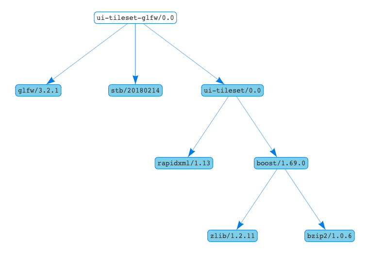

# ui-tileset-glfw

Texture storage/loader using GLFW (OpenGL). Adds a tileset
and retrieve textures one by one.

```
conan create . sword/sorcery
```

## Dependencies

 * [ui-tileset](https://github.com/sword-and-sorcery/ui-tileset)


